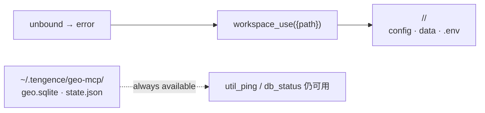
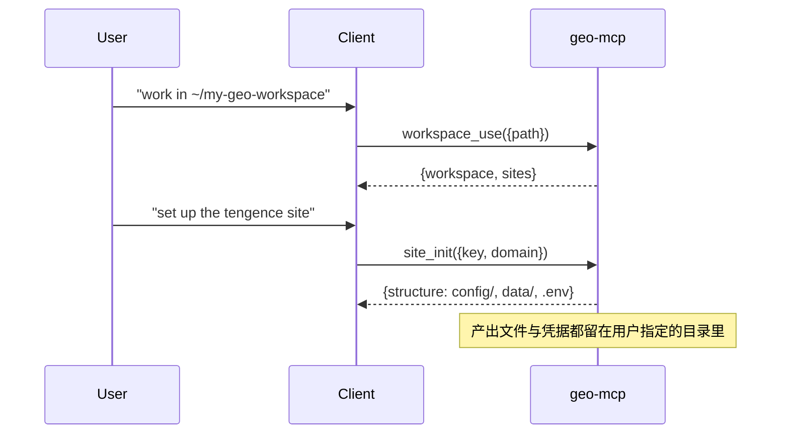

# MCP Integration

`@tengence/geo-mcp` speaks standard MCP over two transports. The server knows nothing
about who is calling it: every client configures the same two things — which bin to run,
and (for HTTP) which URL and token to use.

| Transport | Entry bin | Suitable for | Auth |
| --- | --- | --- | --- |
| stdio | `packages/geo-mcp/bin/geo-mcp.js` | any client that can spawn a local process | none (process boundary) |
| Streamable HTTP | `packages/geo-mcp/bin/geo-mcp-http.js` | remote or browser-based callers | `GEO_MCP_TOKEN` Bearer |

## Zero configuration by design

Nothing needs to be told where things live:

| Kind | Location | Who decides |
| --- | --- | --- |
| Internal runtime data (SQLite, state, logs) | `~/.tengence/geo-mcp/` | the server (fixed) |
| User workspace (per-site config, credentials, output) | wherever the user wants | **the user, at runtime** |

The workspace is never inferred. A spawned process cannot know where the user is working —
`process.cwd()` is whatever directory the client happened to start it in — so instead of
guessing, the server asks once: call **`workspace_use`** with the directory the user chose,
and it is remembered in `~/.tengence/geo-mcp/state.json` for later sessions.



## 1. stdio transport

Add one entry wherever your client keeps its MCP server list:

```json
{
  "mcpServers": {
    "tengence-geo": {
      "command": "node",
      "args": ["<absolute path to this repo>/packages/geo-mcp/bin/geo-mcp.js"]
    }
  }
}
```

That is the whole configuration — no `env` block, no `SITES_ROOT`, no `DB_PATH`, no `APP_ID`.

Two rules, whatever the client is:

1. **`args` must reach this script.** Use the absolute path unless you know the client
   starts the process inside this repository (if it does, the relative form
   `packages/geo-mcp/bin/geo-mcp.js` works and travels with the checkout).
2. **`node` must be v20+ and visible to the spawned process.** GUI-installed clients do not
   read shell rc files, so a node that only exists on your interactive `PATH` is invisible
   to them. Check with:
   `env -i PATH="/usr/local/bin:/usr/bin:/bin:/usr/sbin:/sbin" /bin/sh -c 'node -v'`
   If that fails, put the node binary's absolute path in `command`. On macOS the durable fix
   is a system-level symlink plus `/etc/paths.d/node`.

> The packages are private and not published yet, so `npx -y @tengence/geo-mcp` returns 404.
> Start the local script as shown above.

After enabling, verify with `util_ping` (works before any workspace is bound) — expect
`internal_home`, `db_path`, `workspace: null`, and `driver: "sqlite"`.

## 2. HTTP transport (remote callers)

```bash
GEO_MCP_PORT=8787 GEO_MCP_TOKEN=sk-geo-xxxx \
  node packages/geo-mcp/bin/geo-mcp-http.js
```

Point the client's custom connector at the service:

| Field | Value |
| --- | --- |
| Base URL | `http://127.0.0.1:8787/` (or the intranet address when deployed remotely) |
| Auth | Bearer Token `sk-geo-xxxx` |
| Protocol | MCP Streamable HTTP (auto-detected) |

The connector list then shows all registered tools. `GEO_MCP_TOKEN` is fixed at server
startup; keep the client's Bearer in sync. Without the token the server warns at startup and
accepts unauthenticated connections — local debugging only.

## 3. First-time usage



Either the user's request names a directory, or the tools surface an actionable message
asking for one. From then on, site tools work inside it.

## 4. Optional environment overrides

Only needed when deviating from the defaults:

```text
DB_DRIVER     sqlite (default) | mysql
DB_PATH       SQLite file path (default ~/.tengence/geo-mcp/geo.sqlite)
APP_ID        default tenant (default 1; the site .env overrides it)
SITES_ROOT    pin the workspace instead of using workspace_use
TENGENCE_GEO_HOME  relocate the internal directory (default <home>/.tengence/geo-mcp)
GEO_MCP_TOKEN Bearer token for the HTTP transport
GEO_MCP_PORT  HTTP port (default 8787)
```

`DB_PATH`, `SITES_ROOT` and `TENGENCE_GEO_HOME` all accept `~` — unlike most MCP
clients, this server expands it itself. `TENGENCE_GEO_HOME` supersedes the legacy
`GEO_HOME`, still honoured as a deprecated alias.

## 5. Troubleshooting

- **"No workspace directory is set"** — call `workspace_use` with the directory the user
  wants; nothing was bound (or the remembered one no longer exists).
- **Tool reports "Site not found"** — no site exists under the bound workspace yet; run
  `site_init`, or pass an explicit `site` when several exist.
- **HTTP 401** — `GEO_MCP_TOKEN` mismatch between server startup and client Bearer.
- **SQLite tables missing** — schema auto-initializes on first use; `db_status` shows its state.
- **Cannot reach WordPress** — check `WP_URL / WP_USERNAME / WP_PASSWORD` in the site `.env`;
  `site_status` reports which keys are present.
