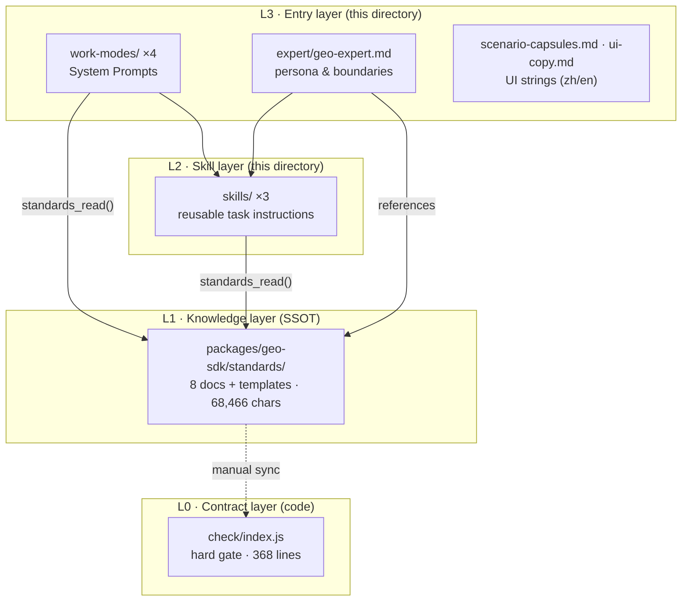

# harness/ — Platform-neutral GEO Content Assets

> Turn the generic standards shipped inside `@tengence/geo-mcp` into the content layer a
> platform can consume: **work-mode System Prompts**, **Skill packages**, and an
> **expert persona**. Everything here is **platform neutral** — paste into WorkBuddy
> Buddy apps, Coze (扣子 / 豆包), Alibaba Bailian (百炼 / 千问), Claude Desktop or any
> other agent platform without rewriting.

## 1. The four layers



| Layer | Where | Role | Change frequency |
|---|---|---|---|
| **L3** entry | `harness/` here | Role, workflow, boundaries, UI copy | low |
| **L2** skills | `harness/` here | Reusable step-by-step task instructions | low |
| **L1** knowledge | `packages/geo-sdk/standards/` | **Single source of truth** — the actual rules | high |
| **L0** contract | `packages/geo-sdk/check/index.js` | Hard, non-negotiable gate in code | medium |

## 2. The rule that keeps this maintainable

> **L2 and L3 never copy rule text. They only say *which document to read*.**

Every rule detail is fetched at runtime via the MCP tool `standards_read('<file>')`.
Consequences:

- One fact source. Changing a rule means editing **L1 only** — no drift across three
  places.
- Progressive loading. `standards/` totals ~68k chars; loading all of it into a System
  Prompt would burn ~40–50k tokens per turn. L3 points at the one file a task needs.
- Cross-platform portability. Users on Coze / Bailian / Claude Desktop have **no** Buddy
  app System Prompt — they only learn the rules from what the MCP server returns. If L3
  duplicated the rules, those users would silently lose them.

## 3. Files and their order

| File | Purpose |
|---|---|
| `README.md` | This file — architecture, per-platform usage, consumption map |
| `work-modes/topic-planning.md` | Mode 1 — keyword matrix, format selection, T1–T7 routing, cadence |
| `work-modes/writing-gate.md` | Mode 2 — drafting against skeleton + research brief, then the gate |
| `work-modes/publishing.md` | Mode 3 — channel publishing, one-draft-many-places, entity claims |
| `work-modes/monitoring.md` | Mode 4 — indexing baseline, AI visibility measurement, refresh |
| `skills/geo-article-writing/SKILL.md` | Draft → gate → fix loop |
| `skills/geo-search-submit/SKILL.md` | Push for indexing after publishing |
| `skills/geo-visibility-monitor/SKILL.md` | Measure and report AI visibility |
| `expert/geo-expert.md` | Expert persona: capabilities, terminology, high-risk confirmation rules |
| `scenario-capsules.md` | Shortcut prompt templates shown above the input box (zh/en) |
| `ui-copy.md` | Slogan, input placeholder (zh/en), binding/authorization copy |

Naming: English kebab-case, no numeric prefixes. The **order** of the work modes is
declared in §5 below, not encoded in filenames.

## 4. How to use on each platform

| Platform | Work modes | Skills | Expert | Tools |
|---|---|---|---|---|
| **WorkBuddy Buddy app** | Paste into 模块2/模块3 work-mode config | Publish as Skill assets in 市场配置 | 专家 module | Install the `tengence-geo-mcp` connector |
| **Coze 扣子** (→ 豆包) | 人设与回复逻辑 (prompt) | 工作流 / 插件 | 单 Agent 人设 | 添加 MCP 插件 |
| **Alibaba Bailian / 千问** | 系统提示词 (规划配置) | 智能体组件 | 智能体人设 | 挂载 MCP 服务 |
| **Claude Desktop / Cursor** | System prompt / `.cursorrules` | Slash commands | — | `mcpServers` in config |

The **MCP server itself is the portable part**: it speaks standard MCP, so the same 56
tools work on every platform above. Only the packaging around it differs.

## 5. Work-mode order (pipeline)

```
1. topic-planning   → what to write, in what format, at what priority
2. writing-gate     → draft it, then pass the editorial gate
3. publishing       → ship it to channels
4. monitoring       → measure indexing + AI visibility, feed back into 1
```

Loop: `monitoring` results trigger `topic-planning` refreshes and `writing-gate`
retirements.

## 6. Consumption map (which standard each asset reads)

| Asset | Standards it must read (via `standards_read`) |
|---|---|
| `work-modes/topic-planning.md` | `content-strategy` |
| `work-modes/writing-gate.md` | `article-writing-standards`, `block-conventions`, `templates/research-brief`, `templates/skeletons/<type>` |
| `work-modes/publishing.md` | `content-platform-integration`, `block-conventions` |
| `work-modes/monitoring.md` | `llm-visibility-monitoring`, `search-engine-integration` |
| `skills/geo-article-writing` | `article-writing-standards`, `block-conventions` |
| `skills/geo-search-submit` | `search-engine-integration` |
| `skills/geo-visibility-monitor` | `llm-visibility-monitoring`, `search-engine-integration` |
| `expert/geo-expert.md` | `INDEX.md` first, then whichever the task needs |

The mirror of this table lives in `packages/geo-sdk/standards/INDEX.md` so the
knowledge layer also documents who consumes it.
